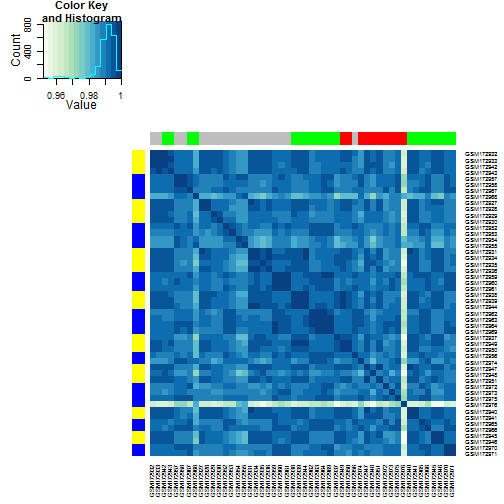

Homework 01
======================================================================

In this assignment you will be analyzing a publicly-available expression study of mouse brain tissue, run on the Affymetrix MGU74Av2 platform. You can read about the study at <http://www.ncbi.nlm.nih.gov/geo/query/acc.cgi?acc=GSE7191>.

The motivation is to study a gene [S1P2, sphingosine-1-phosphate receptor 2](http://www.ncbi.nlm.nih.gov/pubmed/11553273), which, when mutated, results in seizures. In contrast, mutation of the related gene S1P3 does not do this. The study includes two brain regions, hippocampus and neocortex, and three mouse strains (wild type, S1P2 mutant, and S1P3 mutant). In addition the authors provide information on the gender of the mice. Paul was also able to extract "processing date" information from the raw data files (the authors did not explicitly provide this).
<!---Obviously the researchers were looking for genes that change expression in S1P2 mice but not in S1P3 mice, relative to the wild types.--->

You can find two data files for this study [here](../examples/mouseBrain/), specifically the [expression data](../examples/mouseBrain/data/GSE7191-data.txt) and the [design](../examples/mouseBrain/data/GSE7191-design.txt) of the experiment. The data have been re-preprocessed with RMA from the Bioconductor `affy` package, so it is on a log2 scale. Some probes that are considered "controls" were also removed, so overall it's a little different than the processed data provided via GEO. Our focus here is on quality control, exploration, and differential expression analysis.

## Your mission

### Q0 **(0 pts)** Intake

Start by loading data/libraries:

```r
library(ggplot2)
library(lattice)
library(plyr)
library(knitr)
library(gplots)
```

```
## KernSmooth 2.23 loaded
## Copyright M. P. Wand 1997-2009
## 
## Attaching package: 'gplots'
## 
## The following object is masked from 'package:stats':
## 
##     lowess
```

```r
library(RColorBrewer)
library(hexbin)
```

```
## Loading required package: grid
```

```r
library(preprocessCore)
library(limma)
gseDat <- read.table("GSE7191-data.txt", row.names = 1, header = TRUE)
gseDes <- read.table("GSE7191-design.txt", header = TRUE)
```


Check that intake make sense (some hidden, see raw Rmd for more)


```r
str(gseDat, max.level = 0)
```

```
## 'data.frame':	12422 obs. of  50 variables:
```

```r

str(gseDes)
```

```
## 'data.frame':	50 obs. of  4 variables:
##  $ DateRun    : Factor w/ 8 levels "01/16/04","03/11/04",..: 5 5 5 5 6 4 4 6 6 6 ...
##  $ Genotype   : Factor w/ 3 levels "S1P2_KO","S1P3_KO",..: 3 3 3 3 3 3 3 3 3 3 ...
##  $ BrainRegion: Factor w/ 2 levels "hippocampus",..: 2 2 2 2 2 2 2 2 2 2 ...
##  $ Sex        : Factor w/ 2 levels "female","male": 2 2 2 2 2 1 1 1 1 1 ...
```

```r
head(gseDes)
```

```
##            DateRun  Genotype BrainRegion    Sex
## GSM172927 08/21/03 Wild_type   neocortex   male
## GSM172928 08/21/03 Wild_type   neocortex   male
## GSM172929 08/21/03 Wild_type   neocortex   male
## GSM172930 08/21/03 Wild_type   neocortex   male
## GSM172931 09/11/03 Wild_type   neocortex   male
## GSM172932 08/14/03 Wild_type   neocortex female
```

```r
tail(gseDes)
```

```
##            DateRun Genotype BrainRegion    Sex
## GSM172971 07/23/04  S1P2_KO hippocampus female
## GSM172972 01/16/04  S1P3_KO hippocampus   male
## GSM172973 01/16/04  S1P3_KO hippocampus   male
## GSM172974 12/18/03  S1P3_KO hippocampus female
## GSM172975 01/16/04  S1P3_KO hippocampus female
## GSM172976 01/16/04  S1P3_KO hippocampus female
```


Fix date and make genotype a factor for gseDes, also make sample names a column:

```r
gseDes$sampleID <- rownames(gseDes)
gseDes$DateRun <- as.factor(as.Date(gseDes$DateRun, format = "%m/%d/%y"))
gseDes$Genotype <- as.factor(gseDes$Genotype)
str(gseDes)
```

```
## 'data.frame':	50 obs. of  5 variables:
##  $ DateRun    : Factor w/ 8 levels "2003-08-14","2003-08-21",..: 2 2 2 2 3 1 1 3 3 3 ...
##  $ Genotype   : Factor w/ 3 levels "S1P2_KO","S1P3_KO",..: 3 3 3 3 3 3 3 3 3 3 ...
##  $ BrainRegion: Factor w/ 2 levels "hippocampus",..: 2 2 2 2 2 2 2 2 2 2 ...
##  $ Sex        : Factor w/ 2 levels "female","male": 2 2 2 2 2 1 1 1 1 1 ...
##  $ sampleID   : chr  "GSM172927" "GSM172928" "GSM172929" "GSM172930" ...
```


### Q1 **(2 points)** What are the basic characteristics of the data and meta-data? 

#### Q1a: How many probes? How many samples?

Number of probes:

```r
nrow(gseDat)
```

```
## [1] 12422
```


Number of samples:

```r
nrow(gseDes)
```

```
## [1] 50
```


#### Q1b: What is the breakdown of samples for Genotype, BrainRegion, Sex, and DateRun?


```r
table(gseDes$Genotype, gseDes$BrainRegion)
```

```
##            
##             hippocampus neocortex
##   S1P2_KO            10        10
##   S1P3_KO             5         5
##   Wild_type          10        10
```

Seems fairly balanced for each tissue type. If comparing genotypes Wild_type, S1P2_KO and S1P3_KO, the latter is lacking in samples for each tissue type compared to the others. It is nice to see that Wild_type and S1P2_KO are at least balanced.


```r
table(gseDes$DateRun, gseDes$Genotype)
```

```
##             
##              S1P2_KO S1P3_KO Wild_type
##   2003-08-14       4       0         4
##   2003-08-21       0       0         8
##   2003-09-11       0       0         7
##   2003-10-23       7       0         0
##   2003-12-18       1       3         1
##   2004-01-16       0       7         0
##   2004-03-11       4       0         0
##   2004-07-23       4       0         0
```

Most of the Wild_type controls were obtained earlier in addition to in consistancies of when each genotype as collected each day. These differences could confount the results. Optimally each date at would have the same number of collected samples.


```r
table(gseDes$DateRun, gseDes$BrainRegion)
```

```
##             
##              hippocampus neocortex
##   2003-08-14           4         4
##   2003-08-21           4         4
##   2003-09-11           3         4
##   2003-10-23           4         3
##   2003-12-18           2         3
##   2004-01-16           4         3
##   2004-03-11           2         2
##   2004-07-23           2         2
```

More balanced than genetype collection consistancy. There seems to be more samples collected near the later dates that could affect the results.


```r
table(gseDes$Genotype, gseDes$Sex)
```

```
##            
##             female male
##   S1P2_KO       10   10
##   S1P3_KO        6    4
##   Wild_type     10   10
```

Only slightly more females but this may not be a big issue as the others.


```r
table(gseDes$DateRun, gseDes$Sex)
```

```
##             
##              female male
##   2003-08-14      8    0
##   2003-08-21      0    8
##   2003-09-11      6    1
##   2003-10-23      2    5
##   2003-12-18      3    2
##   2004-01-16      3    4
##   2004-03-11      0    4
##   2004-07-23      4    0
```

Again like genotype collection this is all over the place in term of when each was collected.

For good measure here is a cross tabulation with all the counts for all combinations of 4 variables. It may be useful latter to rationalize observations.

```r
table(gseDes$Genotype, gseDes$DateRun, gseDes$Sex, gseDes$BrainRegion)
```

```
## , ,  = female,  = hippocampus
## 
##            
##             2003-08-14 2003-08-21 2003-09-11 2003-10-23 2003-12-18
##   S1P2_KO            2          0          0          1          0
##   S1P3_KO            0          0          0          0          1
##   Wild_type          2          0          3          0          0
##            
##             2004-01-16 2004-03-11 2004-07-23
##   S1P2_KO            0          0          2
##   S1P3_KO            2          0          0
##   Wild_type          0          0          0
## 
## , ,  = male,  = hippocampus
## 
##            
##             2003-08-14 2003-08-21 2003-09-11 2003-10-23 2003-12-18
##   S1P2_KO            0          0          0          3          0
##   S1P3_KO            0          0          0          0          0
##   Wild_type          0          4          0          0          1
##            
##             2004-01-16 2004-03-11 2004-07-23
##   S1P2_KO            0          2          0
##   S1P3_KO            2          0          0
##   Wild_type          0          0          0
## 
## , ,  = female,  = neocortex
## 
##            
##             2003-08-14 2003-08-21 2003-09-11 2003-10-23 2003-12-18
##   S1P2_KO            2          0          0          1          0
##   S1P3_KO            0          0          0          0          2
##   Wild_type          2          0          3          0          0
##            
##             2004-01-16 2004-03-11 2004-07-23
##   S1P2_KO            0          0          2
##   S1P3_KO            1          0          0
##   Wild_type          0          0          0
## 
## , ,  = male,  = neocortex
## 
##            
##             2003-08-14 2003-08-21 2003-09-11 2003-10-23 2003-12-18
##   S1P2_KO            0          0          0          2          1
##   S1P3_KO            0          0          0          0          0
##   Wild_type          0          4          1          0          0
##            
##             2004-01-16 2004-03-11 2004-07-23
##   S1P2_KO            0          2          0
##   S1P3_KO            2          0          0
##   Wild_type          0          0          0
```


*Overall Conclusion about Experimental Design:* It is not optimal but few situations/experiments really are. So long as if what day samples are collected is not a huge deal, the experiment should still be valid.

#### Q1c: Create a plot showing the gene expression data for one probe.

function for processing data:

```r
prepareData <- function(x, dat, des) {
    miniDat <- subset(dat, rownames(dat) %in% x)
    miniDat <- data.frame(gExp = as.vector(t(as.matrix(miniDat))), gene = factor(rep(rownames(miniDat), 
        each = ncol(miniDat)), levels = x))
    miniDat <- suppressWarnings(data.frame(des, miniDat))
    return(miniDat)
}
```


Start by picking a probe at random:

```r
set.seed(540)
genes1 <- row.names(gseDat)[sample(1:nrow(gseDat), 1)]
sDat <- prepareData(genes1, gseDat, gseDes)
```


Plot genotype vs gExp, facetted by BrainRegion and points are coloured by sex:

```r
ggplot(sDat, aes(Genotype, gExp)) + geom_violin() + facet_grid(. ~ BrainRegion) + 
    geom_point(aes(colour = Sex), position = "jitter")
```

 


For fun and to see if date collected does anything interesting, plot with DateRun (date as a continous variable and with genotype as the colour and Sex as symbol shape):

```r
ggplot(sDat, aes(x = DateRun, y = gExp)) + facet_grid(. ~ BrainRegion) + geom_point(aes(shape = Sex, 
    colour = Genotype)) + theme(axis.text.x = element_text(angle = 90, hjust = 1))
```

 


Can't really tell, similar genotypes tended to be colled on the same date.

#### Q1d: Report the average expression of the selected probe for all possible combinations of Genotype, BrainRegion and Sex.


```r
sDatMean <- ddply(sDat, ~Genotype + BrainRegion + Sex, summarize, mean = mean(gExp))
kable(sDatMean, format = "markdown")
```

|Genotype   |BrainRegion  |Sex     |   mean|
|:----------|:------------|:-------|------:|
|S1P2_KO    |hippocampus  |female  |  7.282|
|S1P2_KO    |hippocampus  |male    |  7.344|
|S1P2_KO    |neocortex    |female  |  7.736|
|S1P2_KO    |neocortex    |male    |  7.790|
|S1P3_KO    |hippocampus  |female  |  7.491|
|S1P3_KO    |hippocampus  |male    |  7.377|
|S1P3_KO    |neocortex    |female  |  7.818|
|S1P3_KO    |neocortex    |male    |  7.782|
|Wild_type  |hippocampus  |female  |  7.322|
|Wild_type  |hippocampus  |male    |  7.228|
|Wild_type  |neocortex    |female  |  7.785|
|Wild_type  |neocortex    |male    |  7.647|


### Q2 **(4 points)** Examine the sample correlation matrix.

#### Q2a: Depict the sample-to-sample correlations in a heatmap.

Initial rendering of heatmap (no sorting, leaving dendrogram intact):

```r
# run correlation
corDat <- cor(gseDat)

# gray scale for heatmap
jGnBuFun <- colorRampPalette(brewer.pal(n = 9, "GnBu"))

# functions assigning colours to variables
colorMapGenotype <- function(x) {
    if (x == "S1P3_KO") 
        "red" else if (x == "S1P2_KO") 
        "green" else if (x == "Wild_type") 
        "gray"
}

colorMapBrainRegion <- function(x) {
    if (x == "hippocampus") 
        "blue" else "yellow"
}

cCol <- unlist(lapply(gseDes$Genotype, colorMapGenotype))
rCol <- unlist(lapply(gseDes$BrainRegion, colorMapBrainRegion))
heatmap.2(corDat, col = jGnBuFun, trace = "none", ColSideColors = cCol, RowSideColors = rCol)
```

 

The colours on the side column are the genotype or tissue type. Wild_type is grey, red is S1P3_KO and green is S1P2_KO.
hippocampus is blue and neocortex is yellow.

Already a clear outlier exists (sample GSM172976). Since we seem to have 2 distint groups, that could mean GSM172955, GSM172968 and GSM172954 may also be outliers in there own way, but it seems interesting that they group together. It is also clear that these samples don't really group that much by genotype

Check out any date collection effects may have occured by sorting by DateRun:

```r
ordDes <- gseDes[order(gseDes$DateRun), ]
cCol <- unlist(lapply(ordDes$Genotype, colorMapGenotype))
rCol <- unlist(lapply(ordDes$BrainRegion, colorMapBrainRegion))
heatmap.2(corDat[rownames(ordDes), rownames(ordDes)], trace = "none", dendrogram = "none", 
    Rowv = FALSE, Colv = FALSE, col = jGnBuFun, ColSideColors = cCol, RowSideColors = rCol)
```

 


No trend on date collected does anything to the data. The block correlation we see are likely are due to the tendency to collect equal amounts of tissue on tissue on the same days.

To confirm this lets sort by BrainRegion and then date:

```r
ordDes <- gseDes[order(gseDes$BrainRegion, gseDes$DateRun), ]
cCol <- unlist(lapply(ordDes$Genotype, colorMapGenotype))
rCol <- unlist(lapply(ordDes$BrainRegion, colorMapBrainRegion))
heatmap.2(corDat[rownames(ordDes), rownames(ordDes)], trace = "none", dendrogram = "none", 
    Rowv = FALSE, Colv = FALSE, col = jGnBuFun, ColSideColors = cCol, RowSideColors = rCol)
```

 

Corrlation is strong within the same tissue type.

The triplet from earlier still bugs me. Perhaps showing discritly the dates on which samples were collected could illucidate this.

```r
# for generating categorical values for colouring
selcol <- colorRampPalette(brewer.pal(9, "Set1"))
dateCol <- selcol(length(unique(ordDes$DateRun)))

ordDes <- gseDes[order(gseDes$BrainRegion, gseDes$DateRun, gseDes$Genotype), 
    ]
cCol <- unlist(lapply(ordDes$Genotype, colorMapGenotype))
heatmap.2(corDat[rownames(ordDes), rownames(ordDes)], trace = "none", dendrogram = "none", 
    Rowv = FALSE, Colv = FALSE, col = jGnBuFun, ColSideColors = cCol, RowSideColors = dateCol[ordDes$DateRun])
```

 

The colours on the y axis the dates. They are supposed to be discrete enough for you to see if certain samples were collected on the same date.

We now can see GSM172968 and GSM172954 may be similar due to a batch effect on date run, and they should be similar as they both have the same genotype but it does not explain why GSM172968 groups with them as it occured on a distinctly different date and genotype.

For good measure to investigate effects of sex sort by Sex.

```r
ordDes <- gseDes[order(gseDes$Sex, ordDes$DateRun), ]
cCol <- unlist(lapply(ordDes$Genotype, colorMapGenotype))
rCol <- unlist(lapply(ordDes$BrainRegion, colorMapBrainRegion))
heatmap.2(corDat[rownames(ordDes), rownames(ordDes)], trace = "none", dendrogram = "none", 
    Rowv = FALSE, Colv = FALSE, col = jGnBuFun, ColSideColors = cCol, RowSideColors = rCol)
```

 

If gender has any effect we should see it splitting the matrix like we do with brain region. Again, brain region is the most important.

#### Q2b: Identify the outlier sample. Make a quantitative statement about how it "sticks out".

I'm going to use a method I obtained from this [study](http://geschwindlab.neurology.ucla.edu/protocols/rtutorial2). Basically they use inter-array correlation (IAC), which was defined as the Pearson correlation coefficient of the expression levels. In the paper the use evidence from a dendrogram (like we generated for the heatmap) and mean IAC within sample. I'm going to be honest, I don't really understand it that well but apparently low mean IAC in a sample indicate that it is a likely outlier. If I were to take a stab at explaining it, I would say that this is taking the correlations and generating a distribution from them. Any mean IAC in samples outside of a reasonable threshold like several standard devations from the mean on the whole distribution are likely outliers. Although this is a quanitative metric the threshold to pick seems quiet subjective to me, but I don't really know a better way of doing it.

At any rate I am going to replicate their methods on our data using the meanIAC and threshold cut off of 2 sd as a likely outlier:

```r
# Calculating IACs for all pairs of samples
IAC <- cor(gseDat, use = "p")

# calculate the mean IAC for each array
meanIAC <- apply(IAC, 2, mean)
sdCorr <- sd(meanIAC)
numbersd <- (meanIAC - mean(meanIAC))/sdCorr
numbersdDat <- data.frame(numbersd)
head(numbersdDat)
```

```
##           numbersd
## GSM172927  0.31541
## GSM172928  0.18487
## GSM172929 -0.10731
## GSM172930  0.05514
## GSM172931  0.39991
## GSM172932  0.45446
```


Okay now that we have constructed that do any of them have a low mean IAC (less than -2 sd)?

```r
row.names(numbersdDat)[numbersdDat$numbersd <= -2]
```

```
## [1] "GSM172976"
```


Only GSM172976 seem to be found to be an outlier with this method.

What does the actual distribution look like?

```r
numbersdDat$sample <- row.names(numbersdDat)
numSDDatDes <- data.frame(gseDes, numbersdDat)
ggplot(numSDDatDes, aes(sample, numbersd)) + geom_point(aes(shape = BrainRegion, 
    colour = Genotype)) + theme(axis.text.x = element_text(angle = 90, hjust = 1))
```

 


There it is again, near the bottom more than 6 sd from the mean; with this method it really seems to stick out of the data.

#### Q2c: Examine the outlier in the context of its experimental group.

Which group is the outlier in, in terms of Genotype, BrainRegion, and Sex?

```r
group <- gseDes[gseDes$sampleID == "GSM172976", ]
group
```

```
##              DateRun Genotype BrainRegion    Sex  sampleID
## GSM172976 2004-01-16  S1P3_KO hippocampus female GSM172976
```


Scatter plot these samples against each other and comment on the plot:

```r
# extract the other samples with same group
sampIndexes <- ((gseDes$Genotype == group$Genotype) & (gseDes$BrainRegion == 
    group$BrainRegion) & (gseDes$Sex == group$Sex))
splom(gseDat[, sampIndexes], panel = panel.hexbinplot)
```

 

I tried to address overplotting by using hexbins. It looks like GSM172975 and GSM172974 have a tighter (skinnier) groupings of data points at diagonal points indicating that they are indeed similar in gene expresion for the probes. Any plots with GSM172976 seem to have more spread from the diagonal line indicating that it is not as similar as the other two in gene expresion for the probes.

### Q3 **(4 points)** Normalization, what it can and can't do.

#### Q3a: Make boxplots.

Here are the 2 plots:
  * The data as provided
  * The data after you apply quantile normalization.

First gene expression boxplots no normalization:

```r
# extract the other samples with same group
gseDesDat <- prepareData(row.names(gseDat), gseDat, gseDes)
gseDesDat$outlier <- FALSE
gseDesDat$outlier[gseDesDat$sampleID == "GSM172976"] <- TRUE
ggplot(gseDesDat, aes(sampleID, gExp, colour = outlier)) + geom_boxplot() + 
    theme(axis.text.x = element_text(angle = 90, hjust = 1))
```

 

When I first saw the plot I questioned if I did anything wrong. However, it make sense that it is indeed possible for the outlier to not look that different. Gene expression for many probes is what is making it an outlier. That means is not necessary the overall expression of all the probes that is the issue.

After normalization:

```r
# normalize
gseDatNorm <- data.frame(normalize.quantiles(as.matrix(gseDat)))
rownames(gseDatNorm) <- rownames(gseDat)
colnames(gseDatNorm) <- colnames(gseDat)

# extract the other samples with same group
gseDesDatNorm <- prepareData(row.names(gseDat), gseDatNorm, gseDes)
gseDesDatNorm$outlier <- FALSE
gseDesDatNorm$outlier[gseDesDat$sampleID == "GSM172976"] <- TRUE
ggplot(gseDesDatNorm, aes(sampleID, gExp, colour = outlier)) + geom_boxplot() + 
    theme(axis.text.x = element_text(angle = 90, hjust = 1))
```

 

Well now the data doesn't seem to be as shaky, but I doubt that fixes the problem based on what I mentioned above this.

#### Q3b: Did normalization fix the outlier?

With the quantile-normalized data, re-make the heatmap of the sample correlation matrix and re-compare the outlier to its experimental group. Is everything OK now?


```r
# run correlation
corDatNorm <- cor(gseDatNorm)
cColNorm <- unlist(lapply(gseDes$Genotype, colorMapGenotype))
rColNorm <- unlist(lapply(gseDes$BrainRegion, colorMapBrainRegion))
heatmap.2(corDatNorm, col = jGnBuFun, trace = "none", ColSideColors = cColNorm, 
    RowSideColors = rColNorm)
```

 

The outlier is not gone as expected. Gene expression values are not at incorrect levels, they are simply not agreeing the other samples in terms of what genes are being expressed. It is almost as if the outlier was not the correct tissue type or something.

#### Q3c: Form a dataset that omits the outlier and quantile normalize it.

Removal of GSM172976 from set:

```r
gseDatnoOut <- gseDat
gseDatnoOut$GSM172976 <- NULL
gseDesNoOut <- subset(gseDes, sampleID != "GSM172976")
gseDatnoOutNorm <- data.frame(normalize.quantiles(as.matrix(gseDatnoOut)))
rownames(gseDatnoOutNorm) <- rownames(gseDatnoOut)
colnames(gseDatnoOutNorm) <- colnames(gseDatnoOut)
```


#### Q3d Re-make the heatmap of the sample correlation matrix, now that the worst outlier is gone. Interpret what you see.

```r
corDatnoOutNorm <- cor(gseDatnoOut)
cColnoOutNorm <- unlist(lapply(gseDesNoOut$Genotype, colorMapGenotype))
rColnoOutNorm <- unlist(lapply(gseDesNoOut$BrainRegion, colorMapBrainRegion))
heatmap.2(corDatnoOutNorm, col = jGnBuFun, trace = "none", ColSideColors = cColnoOutNorm, 
    RowSideColors = rColnoOutNorm)
```

 

With the outlier gone it is easier to see contrast within the heatmap. The tissue separation is more prominant and you can see some of the sub clades grouping. There may still be an issue with the 3 samples on the left but you can actually see that they seem to actually correlate more to the brain region they are associated with most.

#### Q3e: Remake the expression boxplots for all samples before moving on to differential expression analysis.

How many samples remain? 

```r
ncol(gseDatnoOutNorm)
```

```
## [1] 49
```


Plotting again:

```r
gseDesDatNoOutNorm <- prepareData(row.names(gseDat), gseDatnoOutNorm, subset(gseDes, 
    sampleID != "GSM172976"))
ggplot(gseDesDatNoOutNorm, aes(sampleID, gExp)) + geom_boxplot() + theme(axis.text.x = element_text(angle = 90, 
    hjust = 1))
```

 


### Q4 **(5 points)** For each probe, test if it has differential expression across the three genotypes *within the neocortex brain region only*.

Worst outlier removed, quantile normalization, restricted to neocortex:

```r
gseDesNoOut <- subset(gseDes, sampleID != "GSM172976")
neoCDes <- subset(gseDesNoOut, BrainRegion == "neocortex")
neoCDesDat <- subset(gseDesDatNoOutNorm, BrainRegion == "neocortex")
neoCDat <- gseDat[, colnames(gseDat) == neoCDes$sampleID]
```


#### Q4a: Write out, in an equation or English or, ideally, both, the model you are fitting.

In the context of that model, what statistical test(s) are you conducting?

I will be using a ANOVA-style, “ref + tx effects” test. In this case we have 1 catagorical covariates: Genotype, with 3 levels (wt, S1P2_KO, S1P3_KO).

Precisely what we are testing if:
$$latex
Y_wt = \theta + \E_w_t
Y_wt,S1P2KO = \theta + \tau + \E
$$


```r
neoCDesMat <- model.matrix(~Genotype, neoCDes)
str(neoCDesMat)
```

```
##  num [1:25, 1:3] 1 1 1 1 1 1 1 1 1 1 ...
##  - attr(*, "dimnames")=List of 2
##   ..$ : chr [1:25] "GSM172927" "GSM172928" "GSM172929" "GSM172930" ...
##   ..$ : chr [1:3] "(Intercept)" "GenotypeS1P3_KO" "GenotypeWild_type"
##  - attr(*, "assign")= int [1:3] 0 1 1
##  - attr(*, "contrasts")=List of 1
##   ..$ Genotype: chr "contr.treatment"
```

```r
neoCFit <- lmFit(neoCDat, neoCDesMat)
neoCFitEB <- eBayes(neoCFit)
topTable(neoCFitEB)
```

```
##             X.Intercept. GenotypeS1P3_KO GenotypeWild_type AveExpr      F
## 101255_at          12.57          -0.027             0.050   12.59 199093
## 96955_at           11.02          -0.031             0.024   11.03 185470
## 98759_f_at         11.85           0.023            -0.065   11.83 185447
## 95359_at           11.84           0.024            -0.005   11.84 185005
## 100343_f_at        11.73           0.071            -0.021   11.74 180122
## 101016_at          11.34           0.010            -0.029   11.33 170583
## 101543_f_at        12.19           0.056            -0.047   12.18 159476
## 96859_at           10.84           0.006            -0.013   10.84 158640
## 100213_f_at        12.62           0.013             0.029   12.63 158245
## 99014_at           10.33           0.073             0.013   10.35 154059
##               P.Value adj.P.Val
## 101255_at   7.475e-66 7.153e-62
## 96955_at    2.216e-65 7.153e-62
## 98759_f_at  2.221e-65 7.153e-62
## 95359_at    2.303e-65 7.153e-62
## 100343_f_at 3.472e-65 8.625e-62
## 101016_at   7.996e-65 1.655e-61
## 101543_f_at 2.245e-64 3.490e-61
## 96859_at    2.434e-64 3.490e-61
## 100213_f_at 2.529e-64 3.490e-61
## 99014_at    3.814e-64 4.738e-61
```


#### Q4b: Explore your hits.

Display the expression data for the top 50 probes in a heat map. Order the probes by p-value; order the samples by genotype.


```r
neoCDesMat <- model.matrix(~Genotype, neoCDes)
str(neoCDesMat)
```

```
##  num [1:25, 1:3] 1 1 1 1 1 1 1 1 1 1 ...
##  - attr(*, "dimnames")=List of 2
##   ..$ : chr [1:25] "GSM172927" "GSM172928" "GSM172929" "GSM172930" ...
##   ..$ : chr [1:3] "(Intercept)" "GenotypeS1P3_KO" "GenotypeWild_type"
##  - attr(*, "assign")= int [1:3] 0 1 1
##  - attr(*, "contrasts")=List of 1
##   ..$ Genotype: chr "contr.treatment"
```

```r
neoCFit <- lmFit(neoCDat, neoCDesMat)
neoCFitEB <- eBayes(neoCFit)
topTable(neoCFitEB)
```

```
##             X.Intercept. GenotypeS1P3_KO GenotypeWild_type AveExpr      F
## 101255_at          12.57          -0.027             0.050   12.59 199093
## 96955_at           11.02          -0.031             0.024   11.03 185470
## 98759_f_at         11.85           0.023            -0.065   11.83 185447
## 95359_at           11.84           0.024            -0.005   11.84 185005
## 100343_f_at        11.73           0.071            -0.021   11.74 180122
## 101016_at          11.34           0.010            -0.029   11.33 170583
## 101543_f_at        12.19           0.056            -0.047   12.18 159476
## 96859_at           10.84           0.006            -0.013   10.84 158640
## 100213_f_at        12.62           0.013             0.029   12.63 158245
## 99014_at           10.33           0.073             0.013   10.35 154059
##               P.Value adj.P.Val
## 101255_at   7.475e-66 7.153e-62
## 96955_at    2.216e-65 7.153e-62
## 98759_f_at  2.221e-65 7.153e-62
## 95359_at    2.303e-65 7.153e-62
## 100343_f_at 3.472e-65 8.625e-62
## 101016_at   7.996e-65 1.655e-61
## 101543_f_at 2.245e-64 3.490e-61
## 96859_at    2.434e-64 3.490e-61
## 100213_f_at 2.529e-64 3.490e-61
## 99014_at    3.814e-64 4.738e-61
```


#### Q4c: Count your hits.

How many probes have unadjusted p-value < 10e-4? If we took the top 50 probes as our "hits", what is the (estimated) false discovery rate? How many of these hits do we expect to be false discoveries?


#### Q4d: Plot the gene expression data for a few top hits and a few boring probes.

What are the p-values associated with these probes? Comment on the plots.


#### Q4e: Find probes where the expression in the S1P3 knockout is different from that of wild type.

How many hits do you find if you control FDR at 0.10?


### Q5 **(5 points)** Differential expression analysis for Genotype * BrainRegion.

You should be using data with the worst outlier removed, after quantile normalization and for both brain regions.

#### Q5a: Fit a 3x2 full factorial model.

Test for any effect of Genotype and/or BrainRegion, i.e. test your model against a model with just an intercept. How many probes have a BH-adjusted p-value, a.k.a. q-value, less than 10e-4?


#### Q5b: Test the null hypothesis that BrainRegion doesn't matter, i.e. that all terms involving BrainRegion are zero.

How many probes have a BH-adjusted p-value less than 0.1?


#### Q5c: Highlight some probes where BrainRegion does and does not matter.

Using the results from Q5b, plot and describe some results for a couple of hits and non-hits.


#### Q5d: Test the null hypothesis that Genotype doesn't matter, i.e. that all terms involving Genotype are zero.

How many probes have a BH-adjusted p-value less than 0.1? Compare these results to those obtained for BrainRegion in Q5b, either based on this count or based on all the p-values. What do you conclude about the relative magnitude of the influence of brain region vs. genotype on gene expression?

