Homework 02
======================================================================

In this assignment we worked with data originally published in "A comprehensive comparison of RNA-Seq-based transcriptome analysis from reads to differential gene expression and cross-comparison with microarrays: a case study in _Saccharomyces cerevisiae_." by Nookaew et al (Nucleic Acids Res. 2012 Nov 1;40(20):10084-97. PMID 22965124). The article is available here: [doi: 10.1093/nar/gks804](http://dx.doi.org/10.1093%2Fnar%2Fgks804).

The authors used two different platforms -- microarrays and RNA-Seq -- to obtain gene expression data for yeast grown in two conditions: batch medium and chemostat. They then compared the results of differential expression analysis (DEA) across platforms and under various combinations of aligners and methods for identifying differential expression. We will do the same. Some of the DEA methods covered in this class were included in their analysis, `edgeR` and `DESeq`, while others were not, such as `limma` and, in particular, the `voom` function.

We will work with their data obtained from the NCBI SRA and GEO repositories. Because of some differences in pre-processing your results will differ from theirs.

## Q1) Microarray Analysis

The six samples in this study, 3 replicates for each of the two conditions, were analysed on the Affymetrix Yeast Genome Array 2.0 platform. We have already downloaded the raw CEL files from GEO and normalised them. The normalized data is saved in the file [`GSE37599-data.tsv`](../../examples/yeastPlatforms/data/GSE37599-data.tsv).

### a) (1pt) Load Microarray Data

Load the normalized data. 

Start by loading data/libraries:

```r
library(ggplot2)
library(lattice)
library(plyr)
library(knitr)
library(gplots)
```

```
## Warning: package 'gplots' was built under R version 3.0.3
```

```
## KernSmooth 2.23 loaded
## Copyright M. P. Wand 1997-2009
## 
## Attaching package: 'gplots'
## 
## The following object is masked from 'package:stats':
## 
##     lowess
```

```r
library(RColorBrewer)
library(hexbin)
```

```
## Loading required package: grid
```

```r
library(preprocessCore)
library(limma)
library(yeast2.db)
```

```
## Loading required package: AnnotationDbi
## Loading required package: BiocGenerics
## Loading required package: parallel
## 
## Attaching package: 'BiocGenerics'
## 
## The following objects are masked from 'package:parallel':
## 
##     clusterApply, clusterApplyLB, clusterCall, clusterEvalQ,
##     clusterExport, clusterMap, parApply, parCapply, parLapply,
##     parLapplyLB, parRapply, parSapply, parSapplyLB
## 
## The following object is masked from 'package:limma':
## 
##     plotMA
## 
## The following object is masked from 'package:stats':
## 
##     xtabs
## 
## The following objects are masked from 'package:base':
## 
##     anyDuplicated, append, as.data.frame, as.vector, cbind,
##     colnames, duplicated, eval, evalq, Filter, Find, get,
##     intersect, is.unsorted, lapply, Map, mapply, match, mget,
##     order, paste, pmax, pmax.int, pmin, pmin.int, Position, rank,
##     rbind, Reduce, rep.int, rownames, sapply, setdiff, sort,
##     table, tapply, union, unique, unlist
## 
## Loading required package: Biobase
## Welcome to Bioconductor
## 
##     Vignettes contain introductory material; view with
##     'browseVignettes()'. To cite Bioconductor, see
##     'citation("Biobase")', and for packages 'citation("pkgname")'.
## 
## Loading required package: org.Sc.sgd.db
## Loading required package: DBI
```

```r
gseDat <- read.table("GSE37599-data.tsv", row.names = 1, header = TRUE)
```

  
What are dimensions of the dataset?

```r
dim(gseDat)
```

```
## [1] 10928     6
```


In addition to reporting number of rows and columns, make it clear what rows and columns represent and how you're interpreting column names:


```r
str(gseDat)
```

```
## 'data.frame':	10928 obs. of  6 variables:
##  $ b1: num  11.15 2.16 1.49 9.01 6.95 ...
##  $ b2: num  6.8 3.18 1.43 9.46 6.9 ...
##  $ b3: num  6.71 3.13 1.82 9.23 6.96 ...
##  $ c1: num  10.95 2.5 1.46 8.97 6.85 ...
##  $ c2: num  6.7 3.05 2.08 9.28 6.9 ...
##  $ c3: num  11.07 2.44 1.62 9 6.89 ...
```

```r
head(gseDat)
```

```
##                b1    b2    b3     c1    c2     c3
## 1769308_at 11.146 6.796 6.708 10.946 6.699 11.071
## 1769309_at  2.164 3.177 3.129  2.498 3.047  2.444
## 1769310_at  1.488 1.427 1.816  1.462 2.079  1.623
## 1769311_at  9.006 9.462 9.235  8.972 9.277  9.005
## 1769312_at  6.946 6.896 6.955  6.851 6.900  6.893
## 1769313_at  7.815 6.600 6.534  7.770 6.564  7.852
```

I am interpreting the columns names as samples and rows names as probes. The intersetions are some measure of expression based on hybridization on the microarray. Column names (ie. samples) with the same prefix (b for batch medium and c for chemostat) have the same conditions.

### b) (2pt) Identify Sample Swap

The labels on two of the samples have been swapped, that is one of the batch samples has been labelled as chemostat and vice-versa. Produce the plots described below and explain how they allow you to identify the swapped samples.
  
i. (High volume) scatter plot matrix. 

```r
splom(gseDat, panel = panel.hexbinplot)
```

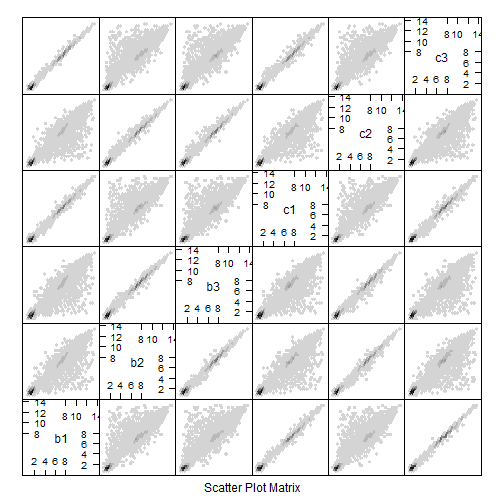 

This plot suggests that c2 is swapped with b1 based on the correlation observed.

ii. A heatmap of the first 100 genes (you can try more but it gets slow).

```r
# colour for heatmap
jGnBuFun <- colorRampPalette(brewer.pal(n = 9, "GnBu"))
heatmap.2(as.matrix(head(gseDat, n = 100)), col = jGnBuFun, trace = "none")
```

 

Again, the plot suggests that c2 is swapped with b1 based on the groupings by the dendrogram and the expression paterns observed.

iii. Compute the Pearson correlation of the samples and plot the results using a heatmap.

```r
# run correlation
corDat <- cor(gseDat)
heatmap.2(corDat, col = jGnBuFun, trace = "none")
```

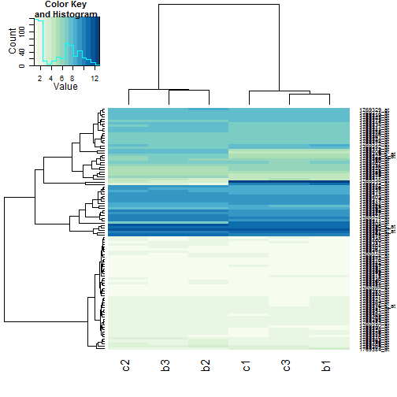 

Again, the plot suggests that c2 is swapped with b1 based on the correlation observed.

iv. Scatterplot the six data samples with respect to the first two principal components and label the samples.

```r
pcs <- prcomp(gseDat, center = F, scale = F)
pcsDat <- data.frame(pcs$rotation[, 1:2])
pcsDat$samples <- rownames(pcsDat)

# with ggplot2
ggplot(pcsDat, aes(x = PC1, y = PC2, colour = samples)) + geom_point()
```

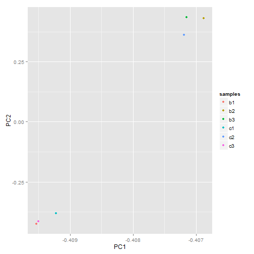 

```r

# with plot /w funtion labels
plot(pcs$rotation[, 1:2])
text(pcs$rotation[, 1:2], row.names(pcs$rotation[, 1:2]), cex = 0.6, pos = 3)
```

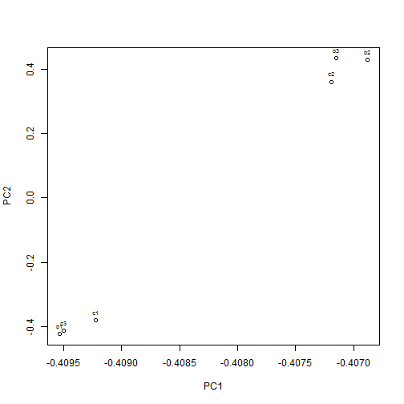 

Again, the plot suggests that c2 is swapped with b1 based groupings.


### c) (2pt) Microarray Differential Expression

Fix the label swap identified in question 1b. We want to swap b1 <--> c2.

```r
# before
head(gseDat)
```

```
##                b1    b2    b3     c1    c2     c3
## 1769308_at 11.146 6.796 6.708 10.946 6.699 11.071
## 1769309_at  2.164 3.177 3.129  2.498 3.047  2.444
## 1769310_at  1.488 1.427 1.816  1.462 2.079  1.623
## 1769311_at  9.006 9.462 9.235  8.972 9.277  9.005
## 1769312_at  6.946 6.896 6.955  6.851 6.900  6.893
## 1769313_at  7.815 6.600 6.534  7.770 6.564  7.852
```

```r

# after
gseDatFix <- gseDat
colnames(gseDatFix) <- c("c2", "b2", "b3", "c1", "b1", "c3")
gseDatFix <- gseDatFix[, c(5, 2, 3, 4, 1, 6)]
head(gseDatFix)
```

```
##               b1    b2    b3     c1     c2     c3
## 1769308_at 6.699 6.796 6.708 10.946 11.146 11.071
## 1769309_at 3.047 3.177 3.129  2.498  2.164  2.444
## 1769310_at 2.079 1.427 1.816  1.462  1.488  1.623
## 1769311_at 9.277 9.462 9.235  8.972  9.006  9.005
## 1769312_at 6.900 6.896 6.955  6.851  6.946  6.893
## 1769313_at 6.564 6.600 6.534  7.770  7.815  7.852
```


Revisit one or more elements of question 1b to sanity check before proceeding. 
scatter plot matrix. 

```r
splom(gseDatFix, panel = panel.hexbinplot)
```

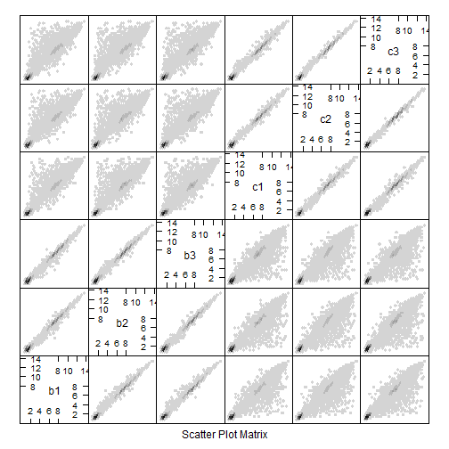 


A heatmap of the first 100 genes (you can try more but it gets slow).

```r
heatmap.2(as.matrix(head(gseDatFix, n = 100)), col = jGnBuFun, trace = "none")
```

 


Compute the Pearson correlation of the samples and plot the results using a heatmap.

```r
# run correlation
corDatFix <- cor(gseDatFix)
heatmap.2(corDatFix, col = jGnBuFun, trace = "none")
```

 


Now use this data to do a differential expression analysis with `limma`.

Package these results in a data frame with six columns:
* probe.id - The array probe id.
* gene.id - The id of the gene which the probe overlaps (see below).
* p.value - The raw p-value for the probe.
* q.value - The BH corrected p-value, aka the q-value.
* log.fc - The log fold change which is the column called "logFC" in the limma results table.
* test.stat - The test statistics which for limma is the moderated t statistic. This is the column called "t" in the limma results table.


```r
# create a design matrix
gseDes <- data.frame(sampleID = colnames(gseDatFix), replicate = c(1, 2, 3), 
    type = c("batch", "batch", "batch", "chemostat", "chemostat", "chemostat"))
rownames(gseDes) <- gseDes$sampleID
gseDes
```

```
##    sampleID replicate      type
## b1       b1         1     batch
## b2       b2         2     batch
## b3       b3         3     batch
## c1       c1         1 chemostat
## c2       c2         2 chemostat
## c3       c3         3 chemostat
```

```r
gseDesMat <- model.matrix(~type, gseDes)
str(gseDesMat)
```

```
##  num [1:6, 1:2] 1 1 1 1 1 1 0 0 0 1 ...
##  - attr(*, "dimnames")=List of 2
##   ..$ : chr [1:6] "b1" "b2" "b3" "c1" ...
##   ..$ : chr [1:2] "(Intercept)" "typechemostat"
##  - attr(*, "assign")= int [1:2] 0 1
##  - attr(*, "contrasts")=List of 1
##   ..$ type: chr "contr.treatment"
```

```r

gseFit <- lmFit(gseDatFix, gseDesMat)
gseFitEB <- eBayes(gseFit)
colnames(coef(gseFitEB))
```

```
## [1] "(Intercept)"   "typechemostat"
```

```r

tTbl <- topTable(gseFitEB, number = Inf, coef = c("typechemostat"))

gseRes <- data.frame(probe.id = rownames(tTbl), gene.id = unlist(mget(rownames(tTbl), 
    yeast2ORF)), p.value = tTbl$P.Value, q.value = tTbl$adj.P.Val, log.fc = tTbl$logFC, 
    test.stat = tTbl$t)
```


Remove any rows with probes which don't map to genes. You'll be able to find these because they will have `NA` as their gene id. Work with this data.frame to answer the questions below.

```r
gseRes <- subset(gseRes, !is.na(gene.id))
head(gseRes)
```

```
##              probe.id gene.id   p.value   q.value log.fc test.stat
## 1772391_at 1772391_at YIL057C 9.478e-14 1.036e-09 10.111    108.93
## 1774122_at 1774122_at YOR388C 4.277e-13 2.337e-09  8.474     89.87
## 1774070_at 1774070_at YMR303C 9.932e-13 3.618e-09  8.991     80.70
## 1776153_at 1776153_at YMR206W 2.248e-12 5.717e-09  7.304     72.70
## 1774072_at 1774072_at YJR095W 2.616e-12 5.717e-09  8.578     71.31
## 1776304_at 1776304_at YDR256C 3.348e-12 5.881e-09  8.081     69.10
```


i. How many probes did we start with and how many remain after removing probes without gene ids?

Probes started with:

```r
nrow(gseDatFix)
```

```
## [1] 10928
```


Probes currently:

```r
nrow(gseRes)
```

```
## [1] 5705
```


ii. Illustrate the differential expression between the batch and the chemostat samples for the top hit (i.e., probe with the lowest p- or q-value).

```r
prepareData <- function(x, dat, des) {
    miniDat <- subset(dat, rownames(dat) %in% x)
    miniDat <- data.frame(gExp = as.vector(t(as.matrix(miniDat))), probe.id = factor(rep(rownames(miniDat), 
        each = ncol(miniDat)), levels = x))
    miniDat <- suppressWarnings(data.frame(des, miniDat))
    return(miniDat)
}

# get top hit
topHit <- gseRes[order(gseRes$p.value), ][1, 1]
topDat <- prepareData(topHit, gseDatFix, gseDes)
ggplot(topDat, aes(type, gExp)) + geom_violin() + geom_point(position = "jitter") + 
    xlab("Method of Measurement") + ylab("Gene Expression")
```

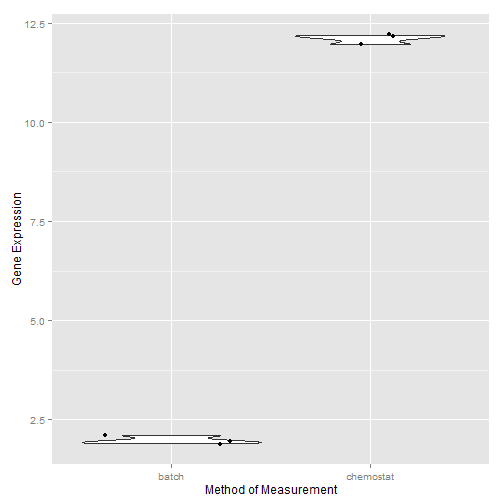 


iii. How many probes are identified as differentially expressed at a false discovery rate (FDR) of 1e-5 (note: this is a FDR cutoff used in the original paper)?

```r
arrayDE <- subset(gseRes[order(gseRes$p.value), ], q.value < 1e-05)
nrow(arrayDE)
```

```
## [1] 725
```


iv. Save your results for later with `write.table()`.


```r
write.table(gseRes, file = "GSE37599-diffExp.txt", row.names = TRUE, col.names = NA)
```


## Q2) RNA-Seq Analysis

We have aligned the RNA-Seq library using the [Stampy](http://www.well.ox.ac.uk/project-stampy) aligner and generated count data. The data file is available [here](../../examples/yeastPlatforms/data/stampy.counts.tsv). In this question you will use this data to do a differential expression analysis using different packages from Bioconductor.

### a) (1pt) Load RNA Count Data and Sanity Check

Load the count data using `read.table`; you will need to pass the arguments `header=TRUE` and `row.names=1`. 


```r
countDat <- read.table("stampy.counts.tsv", header = TRUE, row.names = 1)
```


i) What are dimensions of the dataset?

```r
dim(countDat)
```

```
## [1] 6542    6
```


In addition to reporting number of rows and columns, make it clear what rows and columns represent. What is the difference between the rows of this dataset versus rows of the array data in question 1a?

```r
str(countDat)
```

```
## 'data.frame':	6542 obs. of  6 variables:
##  $ b1: int  11 40 31 63 112 17 0 4 5 0 ...
##  $ b2: int  3 26 52 87 106 21 0 2 8 1 ...
##  $ b3: int  5 10 40 53 60 15 0 2 1 0 ...
##  $ c1: int  13 71 12 51 139 7 0 11 5 1 ...
##  $ c2: int  5 41 18 78 142 6 0 0 5 0 ...
##  $ c3: int  17 48 32 100 127 2 2 3 2 1 ...
```

```r
head(countDat)
```

```
##           b1  b2 b3  c1  c2  c3
## 15S_rRNA  11   3  5  13   5  17
## 21S_rRNA  40  26 10  71  41  48
## HRA1      31  52 40  12  18  32
## ICR1      63  87 53  51  78 100
## LSR1     112 106 60 139 142 127
## NME1      17  21 15   7   6   2
```

I am interpreting the columns names as samples and rows names as genes (in contrast to 1a which were probes on a microarray). The intersetions are read counts. Column names (ie. samples) with the same prefix (b for batch medium and c for chemostat) have the same conditions.

ii) Do a sanity check to make sure there is no sample swap by plotting a heatmap of the sample correlations.

```r
# run correlation
corDat <- cor(countDat)
heatmap.2(corDat, col = jGnBuFun, trace = "none")
```

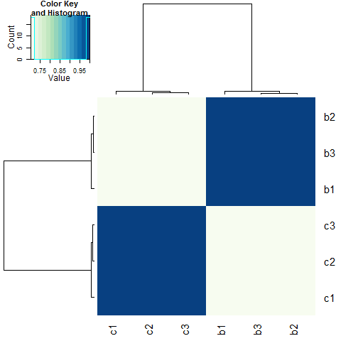 

There Doesn't seem to be a sample swap.

### b) (2pt) `edgeR` Differential Expression Analysis

Now you will use `edgeR` to identify differentially expressed genes between the batch medium vs. chemostat conditions.

i)  Recall that `edgeR` needs to estimate the dispersion parameter in the negative binomial model using an empirical Bayes method. Estimate the dispersion parameters using `estimateGLMCommonDisp`, `estimateGLMTrendedDisp` and `estimateGLMTagwiseDisp`. Plot the tagwise dispersion against log2-CPM (counts per million).  

```r
# load edge R
library(edgeR)

with(gseDes, table(type))
```

```
## type
##     batch chemostat 
##         3         3
```

```r

group <- factor(c(rep("1", 3), rep("2", 3)))
group
```

```
## [1] 1 1 1 2 2 2
## Levels: 1 2
```

```r

dge.glm <- DGEList(counts = countDat, group = group)
design <- model.matrix(~group)
design
```

```
##   (Intercept) group2
## 1           1      0
## 2           1      0
## 3           1      0
## 4           1      1
## 5           1      1
## 6           1      1
## attr(,"assign")
## [1] 0 1
## attr(,"contrasts")
## attr(,"contrasts")$group
## [1] "contr.treatment"
```

```r

# taken from seminar 7
dge.glm.com.disp <- estimateGLMCommonDisp(dge.glm, design, verbose = TRUE)
```

```
## Disp = 0.00551 , BCV = 0.0742
```

```r
dge.glm.trend.disp <- estimateGLMTrendedDisp(dge.glm.com.disp, design)
```

```
## Loading required package: splines
```

```r
dge.glm.tag.disp <- estimateGLMTagwiseDisp(dge.glm.trend.disp, design)
plotBCV(dge.glm.tag.disp)
```

 


ii)  Use the glm functionality of `edgeR`, i.e. use the `glmFit` function, to identify differentially expressed genes between conditions. 

Package these results in a data.frame called 'edger.results' with five columns:
* gene.id - The id of the gene which reads were aligned to.
* p.value - The raw p-value for the gene.
* q.value - The BH corrected p-value, aka the q-value.
* log.fc - The log fold change which is the column called "logFC" in the `edgeR` results table.
* test.stat - The test statistic, which for `edgeR` is a likelihood ratio. This is the column called "LR" in the `edgeR` results table.

```r
fit <- glmFit(dge.glm.tag.disp, design)
lrt <- glmLRT(fit, coef = 2)
tt.glm <- topTags(lrt, n = Inf)$table
edger.results <- data.frame(gene.id = rownames(tt.glm), p.value = tt.glm$PValue, 
    q.value = tt.glm$FDR, log.fc = tt.glm$logFC, test.stat = tt.glm$LR)
```


Save your results for later with `write.table()` in file called `stampy.edger.results.tsv`.

```r
write.table(edger.results, "stampy.edger.results.tsv", row.names = TRUE, col.names = NA)
```


iii) How many genes are differentially expressed between conditions at a false discovery rate (FDR) of 1e-5?

```r
edgerTopGenes <- edger.results[edger.results$q.value < 1e-05, ]
nrow(edgerTopGenes)
```

```
## [1] 2669
```


iv) How many genes are differentially over-expressed in chemostat compared to batch medium samples at a false discovery rate (FDR) of 1e-5?

```r
de.glm <- decideTestsDGE(lrt, p = 1e-05, adjust = "fdr")
summary(de.glm)[3]
```

```
## [1] 1515
```

1515 genes are over-expressed.

### c) (2pt) `DESeq` Differential Expression Analysis

Now you will use `DESeq` to identify differentially expressed genes between the batch medium vs. chemostat conditions.

i)  `DESeq` also needs to estimate the dispersion. Use `estimateSizeFactors` and `estimateDispersions` to normalize the data. Plot the estimated dispersions against the mean normalized counts.


```r
library(DESeq)
```

```
## Loading required package: locfit
```

```
## Warning: package 'locfit' was built under R version 3.0.3
```

```
## locfit 1.5-9.1 	 2013-03-22
##     Welcome to 'DESeq'. For improved performance, usability and
##     functionality, please consider migrating to 'DESeq2'.
```

```r
deSeqDat <- newCountDataSet(countDat, group)
deSeqDat <- estimateSizeFactors(deSeqDat)
deSeqDat <- estimateDispersions(deSeqDat)
plotDispEsts(deSeqDat)
```

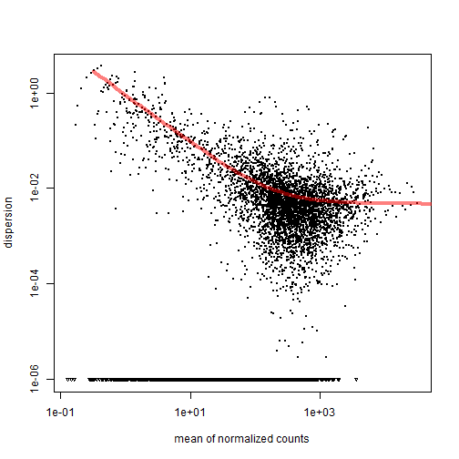 


ii)  Use the negative binomial test of `DESeq`, i.e. use the `nbinomTest` function, to identify differentially expressed genes between conditions. Note that the output of this function does not return results ordered by p-values or logged fold-changes. You can manually reorder the results if you want (not required for this homework).

Package these results in a data.frame called 'deseq.results' with four columns:
* gene.id - The id of the gene which reads were aligned to.
* p.value - The raw p-value for the gene.
* q.value - The BH corrected p-value, aka the q-value.
* log.fc - The log fold change which is the column called "logFC" in the `edgeR` results table.

```r
deSeqResults <- nbinomTest(deSeqDat, levels(group)[1], levels(group)[2])
# reorder by pvalue
deSeqResults <- deSeqResults[with(deSeqResults, order(pval)), ]
deseq.results <- data.frame(gene.id = deSeqResults$id, p.value = deSeqResults$pval, 
    q.value = deSeqResults$padj, log.fc = deSeqResults$log2FoldChange)
```


Save your results for later with `write.table()` in file called `stampy.deseq.results.tsv`.

```r
write.table(deseq.results, "stampy.deseq.results.tsv", row.names = TRUE, col.names = NA)
```


iii) How many genes are differentially expressed between conditions at a false discovery rate (FDR) of 1e-5?

```r
deseqTopGenes <- deseq.results[deseq.results$q.value < 1e-05, ]
nrow(deseqTopGenes)
```

```
## [1] 2198
```


iv) How many differentially expressed genes are identified by both 'edgeR' and 'DESeq'?

```r
sharedGenes <- intersect(edgerTopGenes$gene.id, deseqTopGenes$gene.id)
length(sharedGenes)
```

```
## [1] 2176
```


### d) (2pt) `voom` Differential Expression Analysis

Now you will use `voom+limma` to identify differentially expressed genes between the batch medium vs. chemostat conditions.

i)  `voom` normalizes the counts before it converts counts to log2-cpm. Use `calcNormFactors` to normalize counts.

```r
norm.factor <- calcNormFactors(countDat)
```


ii)  Use `voom' to convert count data into logged CPM data and then use 'limma' to identify differentially expressed genes between conditions. 

Package these results in a data.frame called 'voom.limma.results' with five columns:
* gene.id - The id of the gene which reads were aligned to.
* p.value - The raw p-value for the gene.
* q.value - The BH corrected p-value, aka the q-value.
* log.fc - The log fold change which is the column called "logFC" in the `edgeR` results table.
* test.stat - The test statistic, which is the column called "t".

```r
dat.voomed <- voom(countDat, design, plot = TRUE, lib.size = colSums(countDat) * 
    norm.factor)
```

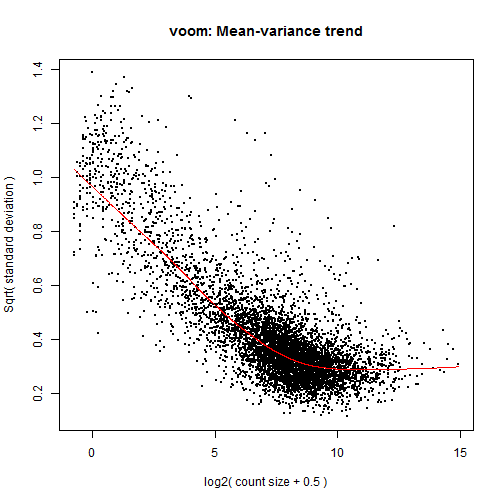 

```r
fit <- lmFit(dat.voomed, design)
fit <- eBayes(fit)
voomTTbl <- topTable(fit, n = Inf, coef = c("group2"))
limma.results <- data.frame(gene.id = rownames(voomTTbl), p.value = voomTTbl$P.Value, 
    q.value = voomTTbl$adj.P.Val, log.fc = voomTTbl$logFC, test.stat <- voomTTbl$t)
```


Save your results for later with `write.table()` in file called `stampy.limma.results.tsv`.

```r
write.table(limma.results, "stampy.limma.results.tsv", row.names = TRUE, col.names = NA)
```


iii) How many genes are differentially expressed between conditions at a false discovery rate (FDR) of 1e-5?

```r
limmaTopGenes <- limma.results[limma.results$q.value < 1e-05, ]
nrow(limmaTopGenes)
```

```
## [1] 1794
```


iv)  What fraction of the genes identified using `voom+limma` are also found by `edger` and `DESeq` methods? For example if the DE analysis using `voom+limma` found 1000 genes and both `edgeR` and `DESeq`  found 500 of these, the fraction of genes found would be $\frac{500}{1000}=0.5$.

```r
sharedGenes3 <- intersect(limmaTopGenes$gene.id, sharedGenes)
length(sharedGenes3)/length(limmaTopGenes$gene.id)
```

```
## [1] 0.9989
```


### e) (3pt) Comparison of Differential Expression Analyses
 
Now that we have the results of the differential expression analysis performed by three popular methods, we are going to compare and illustrate the results.

i) In previous questions, we noticed that different methods identified different differentially expressed genes. Create a Venn diagram showing all genes identified as differentially expressed by `edgeR`, `DESeq`, and `voom+limma`. Check your if your answers to questions 2c-iv, and 2d-iv are correct.


```r
library(VennDiagram)

de.genes <- list(voom_limma = limmaTopGenes$gene.id, edger = edgerTopGenes$gene.id, 
    DESeq = deseqTopGenes$gene.id)

plot.new()
venn.plot <- venn.diagram(de.genes, filename = NULL, fill = c("red", "blue", 
    "green"))

grid.draw(venn.plot)
```

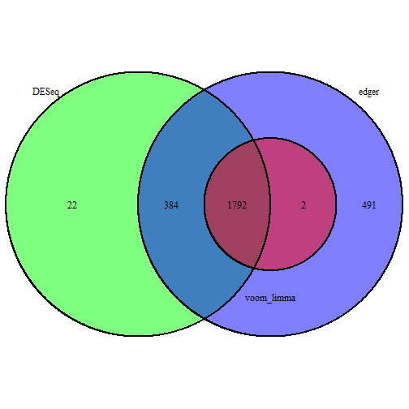 


ii) Using the function `plotSmear` function from `edgeR`, you can look at a scatterplot of observed differential expression (y-axis) against overall abundance (x-axis), both axes logarithmically transformed -- to check that putative DE genes seem plausible. Create a smear plot. Within this plot, identify the set of genes which are differentially expressed at an FDR of 1e-5 using all three methods (i.e., the q-values estimated by `edgeR`, `DESeq`, and `voom` are below 1e-5). Explain how you interpret this plot. Do you see reasonable results?


```r
plotSmear(dge.glm, de.tags = sharedGenes3)
```

 

TODO EXPLAIN PLOT!!

iii) There are two genes identified by `edgeR` and `voom+limma` but not by `DESeq`. Illustrate the logged counts of them. Compare the (log) counts of these two genes with those of two genes identified by the three methods (see example below)


```r
missingGenes <- setdiff(intersect(limmaTopGenes$gene.id, topGenes$gene.id), 
    deseqTopGenes$gene.id)
```

```
## Error: error in evaluating the argument 'x' in selecting a method for function 'setdiff': Error in intersect(limmaTopGenes$gene.id, topGenes$gene.id) : 
##   error in evaluating the argument 'y' in selecting a method for function 'intersect': Error: object 'topGenes' not found
```

```r
(featureCounts <- countDat[missingGenes, ])
```

```
## Error: object 'missingGenes' not found
```

```r
featureDat <- data.frame(gene.id = factor(rep(rownames(featureCounts), ncol(featureCounts))), 
    cond = factor(rep(group, each = nrow(featureCounts))), log.count = log2(unlist(featureCounts)))
```

```
## Error: error in evaluating the argument 'x' in selecting a method for function 'rownames': Error: object 'featureCounts' not found
```

```r
stripplot(gene.id ~ log.count, featureDat, group = cond, auto.key = TRUE, jitter = TRUE)
```

```
## Error: object 'featureDat' not found
```

TODO: DISCUSS!!

## Q3) Compare DEA results between RNA-Seq and array

In question 1, you performed a DEA of array data using `limma`. In question 2a, you performed a DEA of RNA-Seq data using `edgeR`, among other methods. In this question you will compare the results of those two analyses. 

i) Use a Venn diagram to display the overlap and non-overlap of the __genes__ identified as differentially expressed at an FDR of 1e-5 by these analyses.


```r
edgeRDEGenes <- list(RNA_Seq = edgerTopGenes$gene.id, Array = arrayDE$gene.id)
plot.new()
venn.plot <- venn.diagram(edgeRDEGenes, filename = NULL, fill = c("red", "blue"), 
    force.unique = TRUE)
grid.draw(venn.plot)
```

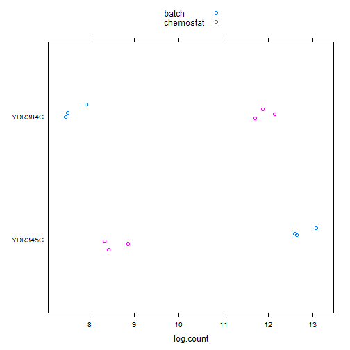 


ii) As expected, more genes were identified as differentially expressed using RNA-Seq data. In this question, you will examine the difference between the q-values from both analyses by overlaying density plots of the q-values from each analysis.

To respond to this question, make two plots:
* One plot that includes the densities of q-values of the genes analyzed by both platforms (i.e., genes shared by both data frames)
* another plot that includes the densities of q-values of ALL genes analyzed by at least one of the platforms.
Make some observations about the strengths of these two platforms.

Densities of q-values of the genes analyzed by both platforms:

```r
bothDat <- intersect(edger.results$gene.id, gseRes$gene.id)

p <- ggplot(edger.results[edger.results$gene.id %in% bothDat, ], aes(x = q.value)) + 
    geom_density(fill = "blue", alpha = 0.5)
p <- p + geom_density(data = gseRes[gseRes$gene.id %in% bothDat, ], fill = "red", 
    alpha = 0.5)
p
```

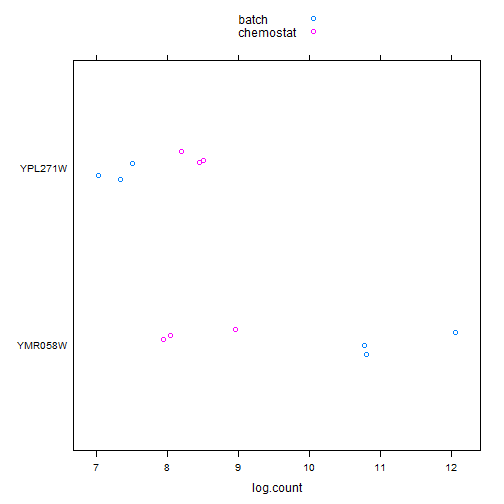 

TODO: COMMENT AND ADD LEGEND FOR WHAT EACH COLOUR MEANS

Densities of q-values of ALL genes analyzed by at least one of the platforms:

```r
allDat <- union(edger.results$gene.id, gseRes$gene.id)

p <- ggplot(edger.results[edger.results$gene.id %in% allDat, ], aes(x = q.value)) + 
    geom_density(fill = "blue", alpha = 0.5)
p <- p + geom_density(data = gseRes[gseRes$gene.id %in% allDat, ], fill = "red", 
    alpha = 0.5)
p
```

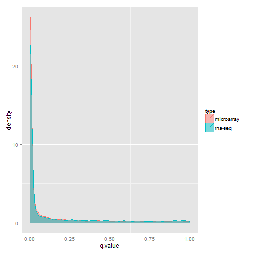 


iii) We provide a data set with array expression and count data for 5 interesting genes; below is also code to load it and a figure depicting it.

Consult the DEA results from your previous analyses for these genes. For each gene, state its status with respect to these analyses, i.e. where it falls in those Venn diagrams. Comment on the results and plots.


```r
jDat <- dget("featGenesData-q3-DPUT.txt")
```

```
## Warning: cannot open file 'featGenesData-q3-DPUT.txt': No such file or
## directory
```

```
## Error: cannot open the connection
```

```r

ggplot(jDat, aes(x = arrayExp, y = probe.id, colour = cond)) + geom_point()
```

```
## Error: object 'jDat' not found
```

```r
ggplot(jDat, aes(x = log.count, y = probe.id, colour = cond)) + geom_point()
```

```
## Error: object 'jDat' not found
```

```r

jDat$array <- jDat$gene.id %in% arrayDE$gene.id
```

```
## Error: object 'jDat' not found
```

```r
jDat$limma <- jDat$gene.id %in% limmaTopGenes$gene.id
```

```
## Error: object 'jDat' not found
```

```r
jDat$edger <- jDat$gene.id %in% edgerTopGenes$gene.id
```

```
## Error: object 'jDat' not found
```

```r
jDat$deseq <- jDat$gene.id %in% deseqTopGenes$gene.id
```

```
## Error: object 'jDat' not found
```

```r
jDat
```

```
## Error: object 'jDat' not found
```


YDR345C: Significant in all

YDR384C: Significant in all

YBL025W: not significant in all in all

YCL042W: Significant in only RNA-seq Edge R computed set.

YGL209W: Significant in only Microarray computed set.

TODO DISCUSS
